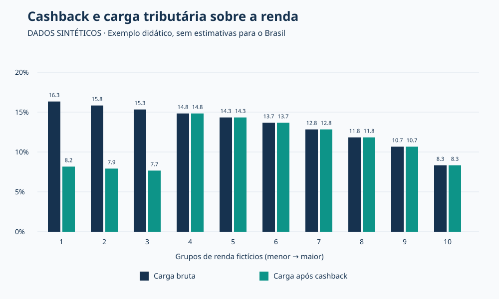

# Cashback tributário: uma demonstração reproduzível

**Projeto didático com dados sintéticos — versão inicial para revisão.**

Este exemplo explora como uma devolução focalizada pode alterar a carga de um tributo sobre o consumo em grupos com diferentes rendas. Integra o portfólio de Luis Felipe Tarouquela Contreras, dedicado a Economia aplicada, análise de dados e políticas públicas.

**Não utiliza microdados da POF, não reproduz resultados da dissertação e não implementa regras legais de cashback.** Os valores foram escolhidos exclusivamente para explicar o mecanismo. Código e documentação foram preparados com assistência de IA; a validação empírica com dados reais ainda não foi realizada.

## Pergunta

Como a relação entre tributo e renda muda quando parte do tributo é devolvida a grupos de menor renda, mantendo o consumo e a alíquota constantes?

## Visualização



## Hipóteses e método

- Dez grupos fictícios de igual tamanho, ordenados por renda. Cada linha é um domicílio representativo de seu grupo, sem diferenças de composição familiar.
- Renda e consumo são valores mensais em reais, sem data-base empírica. Os parâmetros estão no início de `simular.py`.
- A proporção consumida da renda diminui de 98% para 50% por construção. Por isso, a carga bruta relativa à renda também diminui por construção; isso não é uma descoberta sobre a população brasileira.
- Todo o consumo é tributado com alíquota hipotética de 20% sobre o preço antes do tributo. O consumo informado já inclui o tributo.
- Sem cashback: carga líquida igual à carga bruta.
- Com cashback: devolução de 50% do tributo aos grupos 1 a 3, e zero aos demais. A elegibilidade por grupo é uma simplificação didática.
- Renda, preços e quantidades consumidas permanecem fixos; não há respostas comportamentais, informalidade ou custos administrativos.

Para consumo total C, renda Y, alíquota t e fração devolvida r:

```text
Tributo bruto = C × t / (1 + t)
Cashback = Tributo bruto × r
Tributo líquido = Tributo bruto − Cashback
Carga sobre a renda (%) = 100 × Tributo / Y
```

O modelo não mantém a arrecadação líquida constante entre cenários: a devolução reduz a receita, sem compensação por outro tributo. Não calcula Gini, Kakwani, pobreza, efeitos causais ou impactos fiscais nacionais.

## Leitura dos resultados sintéticos

No primeiro grupo, a carga passa de 16,33% para 8,17% da renda; no terceiro, de 15,33% para 7,67%. A partir do quarto grupo, não muda. São consequências das hipóteses, não estimativas empíricas.

A focalização produz uma descontinuidade entre os grupos 3 e 4. Isso permite discutir o desenho da elegibilidade, mas não permite concluir qual regra seria ideal para o Brasil.

## Como reproduzir

Requer Python 3.9 ou superior. Usa apenas a biblioteca padrão, sem instalação de pacotes ou acesso à rede. No terminal, a partir da raiz do repositório:

```bash
python projetos/cashback-demo/simular.py
python -m unittest discover -s projetos/cashback-demo -v
```

Se a pasta do projeto tiver sido baixada separadamente, execute dentro dela:

```bash
python simular.py
python -m unittest -v
```

As saídas são gravadas na pasta `resultados/` do próprio projeto. A execução substitui os dois arquivos de saída existentes e não modifica dados externos. Não há aleatoriedade: os mesmos parâmetros produzem os mesmos resultados.

## Arquivos

| Arquivo | Conteúdo |
|---|---|
| `simular.py` | Parâmetros, cálculo e geração do gráfico |
| `test_simular.py` | Testes de identidade contábil, limites e elegibilidade |
| `resultados/resultados.csv` | Resultados numéricos sintéticos, com seis casas decimais |
| `resultados/carga-tributaria.svg` | Gráfico reproduzível em formato vetorial |
| `PROXIMOS_PASSOS.md` | Roteiro para futura aplicação empírica |

### Dicionário das saídas

`grupo`: posição na distribuição fictícia (1 a 10); `renda` e `consumo`: reais/mês por domicílio; `tributo_bruto`, `cashback` e `tributo_liquido`: reais/mês; `carga_bruta_pct` e `carga_liquida_pct`: percentual da renda. A tabela também contém todos os insumos por grupo necessários à conferência manual.

## English summary

An educational, reproducible example of consumption-tax cashback using ten synthetic income groups. It uses a hypothetical 20% tax-exclusive rate and refunds half of the tax to the first three groups. It is not calibrated to Brazilian data, does not implement statutory rules, and does not reproduce dissertation findings. Python's standard library generates a results table and an SVG chart. See `simular.py` and `test_simular.py`.

## Perfil

[GitHub](https://github.com/lftcontreras) · [LinkedIn](https://www.linkedin.com/in/luisfelipecontreras/) · [ORCID](https://orcid.org/0009-0009-0387-0558)
