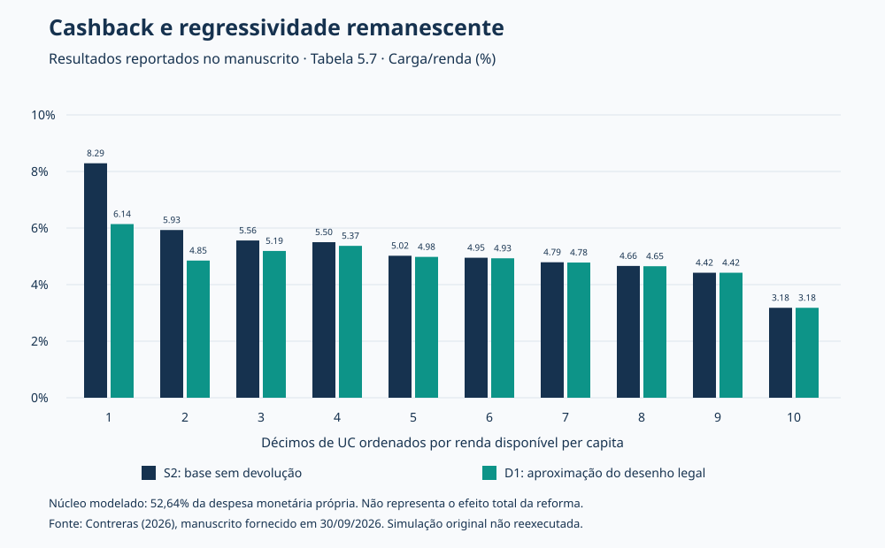

# Cashback tributário e regressividade remanescente

**Resultados reportados na dissertação de Luis Felipe Tarouquela Contreras (UFF, 2026).**

Este projeto apresenta tabelas selecionadas do manuscrito *Cashback tributário e regressividade remanescente: desenho da devolução e equidade em uma microssimulação com a POF 2017–2018*. A extração foi feita a partir do DOCX fornecido pelo autor em 30/09/2026, com data de versão 25/09/2026 no nome do arquivo. Não se presume defesa, aprovação ou publicação institucional.

O código deste diretório reproduz a visualização das tabelas. **Não reproduz a microssimulação original**, pois ainda não foi confirmada a correspondência entre os scripts recuperados e a versão final do manuscrito. O DOCX recebido não incorpora os scripts nem os dados de entrada. Os números são resultados reportados pelo manuscrito, sem validação independente com microdados.

## Pergunta e recorte

Em que medida a devolução reduz a regressividade remanescente após a desoneração da cesta básica e como desenhos alternativos se comparam sob o mesmo orçamento simulado?

Segundo o documento, a análise utiliza 58.039 unidades de consumo (UC) da POF 2017–2018. Os décimos são ponderados por UC e ordenados por renda disponível per capita. O núcleo fiscal parametrizado cobre **52,64% da despesa monetária própria**. O restante não pode ser tratado como se tivesse sido integralmente modelado no cenário central.

## Resultado central reportado



Da base S2, sem devolução, à aproximação do desenho legal D1:

- O Kakwani passa de **−0,1141 para −0,0845** (Tabela 5.3), permanecendo negativo.
- A carga do primeiro décimo cai de **8,29% para 6,14% da renda**, diferença de 2,15 pontos percentuais calculada com valores arredondados (Tabela 5.7).
- No décimo superior, ambos os valores reportados são **3,18%**.

Esses resultados são condicionais às hipóteses e à cobertura do modelo. Não medem efeitos causais nem o efeito total da reforma em relação ao sistema anterior.

## Desenhos sob orçamento simulado comum

Valores transcritos da Tabela 5.13. Todos os desenhos utilizam R$ 452,74 milhões mensais, a preços de janeiro de 2018, conforme o documento; esse valor não é uma projeção fiscal em preços atuais.

| Desenho | Kakwani | Carga do primeiro décimo (% da renda) |
|---|---:|---:|
| D1 — aproximação do desenho legal | −0,0845 | 6,14 |
| D2 — transferência per capita | −0,0828 | 5,68 |
| D3 — híbrido 50/50 | −0,0837 | 5,91 |
| D4 — saída gradual | −0,0834 | 6,26 |

D2 apresenta o Kakwani menos negativo e a menor carga do primeiro décimo entre os quatro desenhos reportados. D4 tem Kakwani menos negativo que D1, mas carga do primeiro décimo maior: a comparação depende do indicador considerado.

## Origem e rastreabilidade

`tabelas.json` preserva os cabeçalhos e a representação textual dos valores das Tabelas 5.3, 5.7, 5.13 e 5.19, incluindo vírgulas decimais e arredondamento. A seção `fonte` registra título, autor, versão do arquivo e SHA-256 do DOCX recebido. O arquivo completo da dissertação não foi adicionado ao repositório.

Unidades: na Tabela 5.3, carga em R$/UC/mês, Kakwani e Gini adimensionais, FGT₀ em percentual; na Tabela 5.7, carga em percentual da renda; na Tabela 5.13, custo em R$ milhões/mês, carga e UC com benefício superior ao tributo em percentual, B/T como razão; na Tabela 5.19, estimativas e intervalos em unidades do índice Kakwani.

## Reproduzir o gráfico

Com Python 3.9 ou superior, sem pacotes externos, execute na raiz do repositório:

```bash
python projetos/dissertacao-resultados/gerar_grafico.py
```

O programa lê as tabelas extraídas, confere a estrutura dos décimos, o orçamento comum e a consistência do primeiro décimo entre duas tabelas, e recria `carga-reportada.svg`. Não estima índices, intervalos ou novos cenários. As checagens não validam a pesquisa original.

## Pendência identificada no documento

O FGT₀ de D1 com registro restritivo aparece como **13,33% na Tabela 5.3** e **13,34% na Tabela 5.11**. A diferença deve ser reconciliada com as saídas originais; este projeto não escolhe um valor corrigido. A extração da Tabela 5.3 mantém 13,33% por fidelidade à fonte. Esse indicador não foi usado nos destaques nem no gráfico.

## Próxima etapa para reprodução integral

Foi recuperado um pacote de auditoria datado de 10/09/2026, contendo scripts e insumos. Ele ainda não foi reexecutado nem reconciliado com a versão de 25/09/2026, especialmente D2–D4 e hot-deck. Para a reprodução integral da versão final, é necessário conferir os scripts de construção da base e simulação, a matriz fiscal com 8.365 códigos mencionada no texto, os parâmetros efetivamente utilizados, instruções de obtenção dos dados, dependências e saídas originais. Com esses materiais será possível auditar os resultados, reproduzir as réplicas e reconciliar a pendência numérica.

A demonstração sintética em `../cashback-demo/` é um exemplo didático separado e não deve ser usada para gerar os resultados desta dissertação.

## Referência

CONTRERAS, Luis Felipe Tarouquela. *Cashback tributário e regressividade remanescente: desenho da devolução e equidade em uma microssimulação com a POF 2017–2018*. Manuscrito de dissertação, Programa de Pós-Graduação em Economia, Universidade Federal Fluminense, 2026. Orientador: Fábio Domingues Waltenberg. Versão fornecida pelo autor em 30 set. 2026.

Preparação da extração, documentação e visualização com assistência de IA. [Perfil do autor](https://github.com/lftcontreras) · [ORCID](https://orcid.org/0009-0009-0387-0558).
